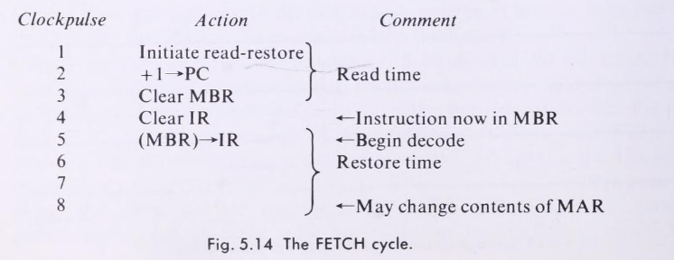

Blue

- 4096 words of addressed core storage of 16 bits per word
- Words in data storage as treated as 15-bit integers plus sign
- Instructions are 4 bit OP code with 12 bit address (4096).
- 16-bit Acc
- 16-bit instruction register
- 12-bit program counter
- 12-bit Memory Address Register, 16-bit Memory Buffer Register and a 16-bit Z register that are not accessible to the programmer.
- 16 different instructions for the 4-bit OPCode.
- If the highest bit is 1, the number is negative.
- *Shadow time* is the time that it takes for the fetched instruction to be rewritten, memory referencing instructions must wait until the fetched instruction is rewritten and the memory is available. (It means the bus maybe?)

## Instruction Set

Octal representation for Op code

- 00-HLT XXXX: The computer will halt. The START button on the console will cause the computer to start going again, beginning with the instruction following the HLT.
- 01-ADD XXXX: The contents of XXXX are added tot the contents of the accumulator and the sum is put into the accumulator. If the result is greater than 2^15-1 or less than -2^15 the machine stops.
- 02-XOR XXXX: Exclusive OR of the contents of XXXX and Acc replace Acc.
- 03-AND XXXX: AND between address and Acc, replace Acc.
- 04-IOR XXXX: OR
- 05-NOT XXXX: Acc is inverted
- 06-LDA XXXX: Loads addresss into the Acc.
- 07-STA XXXX: Acc is copied to Address. Acc remains unchanged.
- 10-SRJ XXXX: Contents of program counter(present instruction location plus one) are ORed into 12 Acc bits. XXXX is copied into the program counter, used to jump.
- 11-JMA XXXX: If the sign bit of the Acc is one, the number XXXX is placed in the program counter. Else, does nothing.
- 12-JMP XXXX: Jumps to address XXXX
- 13-INP XXYY: Upper 8 bits of the Acc are cleared and the next 8-bit character from input device YY is entered into the low end of Acc. The XX part of the field is ignored. Blocks until transfer is complete.
- 14-OUT XXYY: The upper 8 bits of the Acc are sent to output device YY. The XX is ignored. Blocks until the device accepts data.
- 15-RAL XXXX: Acc is rotated left one place.
- 16-CSA XXXX: The number set into the console switch register replaces the contents of the accumulator.
- 17-NOP XXXX: Does nothing.

## Control Unit
Blue is a synchronous machine. 
It will have three flip-flops: 
- **RUN**: It is turned ON by the START button and OFF by the STOP button, by HLT and by arithmetic overflow.
- **STATE**: Set to FETCH by the START button or at the end of an execute cycle. It may or may not set to EXECUTE depending on the IR.
- **TRA**: Transfer in progress

The clock containts 8 output lines, each will carry a minor cycle delayed by 125nsec each.
The RUN flipflop enables and starts the clock. If the STATE is FETCH, the machine will load the IR from what is pointed at the PC, then increment the PC.

